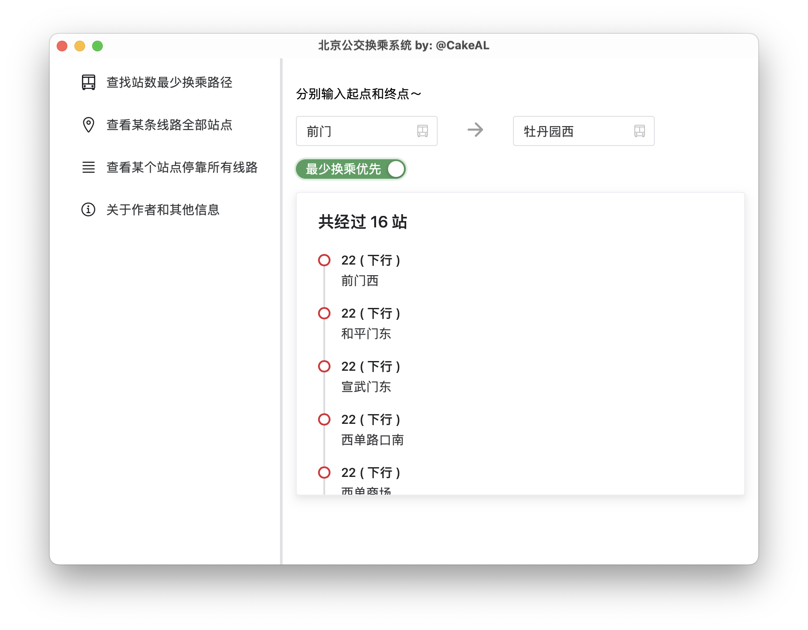

# Beijing Bus Transfer System 北京公交换乘系统

## 简介

基于 Tauri 框架构建应用，前端使用 Vite + Vue，后端使用 Rust 进行调用 sqlite3 数据库，并进行推荐从 A 站到 B 站的换乘线路。 \
同时使用 python 进行爬取北京公交官网数据。 \
系 USTB 物联网工程大三下人工智能与机器学习大作业——公交换乘系统设计与开发（2 人组） \

## 功能

1. 根据用户输入的起点站和终点站找到最短路径（可选站数最少，不是路程或时间，或者换乘最少，根据按钮来切换）。
2. 根据用户输入并选择某条线路查看某条线路全部站点。
3. 根据用户输入并选择某站查看该站所有的线路。
4. 上述 2 和 3 可以点击对应的内容跳转到对应的线路/站点的详细信息。
5. 因为查询耗时，所以添加了“焦虑的安慰剂，疗效尚可”的加载条。

## 截图

  
  


## 关于数据

从北京公交官网首页爬取(2024 年 5 月)，且该数据已经过期。不具有事实上的参考意义。

可以考虑使用北京公交实时公交的接口。但是那里不能一次性获得全部线路。

## 构建和运行

大概是 macOS，Windows 和 Linux 都能运行的。 \
首先确保你已经安装了[`Node.js`](https://nodejs.cn/download/)，[`pnpm`](https://www.pnpm.cn/)以及[`Rust环境`](https://www.rust-lang.org/zh-CN/tools/install)

```bash
# 安装 tauri
cargo install create-tauri-app --locked
# 运行
cargo tauri dev
# 或者
pnpm i
pnpm tauri dev
```

python 爬取数据使用方法（已经有爬好的数据，在`bus-data/bus.db`）： \
[`python-scripts/README.md`](python-scripts/README.md)

## LICENSE

[LICENSE](LICENSE)
